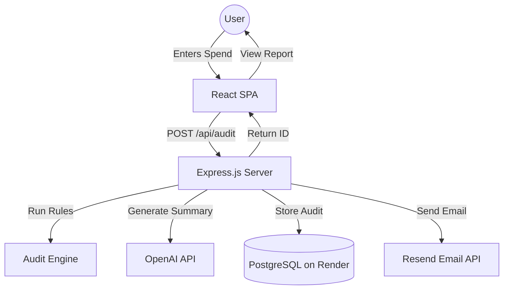

# Architecture

This document describes the technical architecture and design decisions for AI Spendly.

## System Diagram

## Data Flow

1.  **Input Collection**: The React frontend captures user inputs (tools, plans, seats, use case) and persists them in `localStorage` to prevent data loss on reload.
2.  **Audit Execution**: Upon submission, the payload is sent to `POST /api/audit`. The `auditEngine.js` (a pure JS module) runs a series of deterministic rules to calculate potential savings based on `PRICING_DATA.md`.
3.  **Qualitative Summary**: The backend calls the OpenAI API with a structured prompt (see `PROMPTS.md`) to generate a ~100-word personalized summary.
4.  **Persistence**: The audit result, along with lead information (if provided), is stored in the SQLite database. Identifying info is stored securely, while a `public_id` is used for sharing.
5.  **Viral Loop**: The frontend generates a unique URL (e.g., `/report/:id`) with Open Graph tags in the HTML header (handled by the server for SSR previews) for social sharing.

## Tech Stack Choice

- **React + Vite**: Chosen for its fast development cycle and massive ecosystem. Vite provides near-instant HMR, which is essential for rapid UI polish.
- **Node.js + Express**: A standard choice for building lightweight APIs. Its non-blocking I/O is ideal for handling multiple external API calls (OpenAI, Resend).
- **PostgreSQL on Render**: A managed PostgreSQL database service providing scalability, reliability, and seamless integration with production deployments. Offers connection pooling and automatic backups for enterprise-grade data management.
- **Tailwind CSS**: Enabled the "Premium SaaS" aesthetic required by the brief without the overhead of a heavy component library.

## Scaling to 10k Audits/Day

To handle 10,000 audits per day (approx. 7 audits/minute, with potential bursts), I would implement the following:

1.  **Database Optimization**: PostgreSQL on Render already supports concurrent writes and connection pooling. At higher scale, implement read replicas and query optimization.
2.  **Caching**: Implement Redis to cache pricing data and frequently accessed public reports, reducing DB load.
3.  **Queueing**: Offload the OpenAI summary generation and Resend email triggers to a background worker (e.g., BullMQ) so the API response remains fast even if external services are slow.
4.  **Rate Limiting**: Implement stricter IP-based rate limiting using `express-rate-limit` to prevent API abuse.
5.  **CDN**: Use a CDN (Cloudflare) to serve the frontend assets and cache the Open Graph images.
